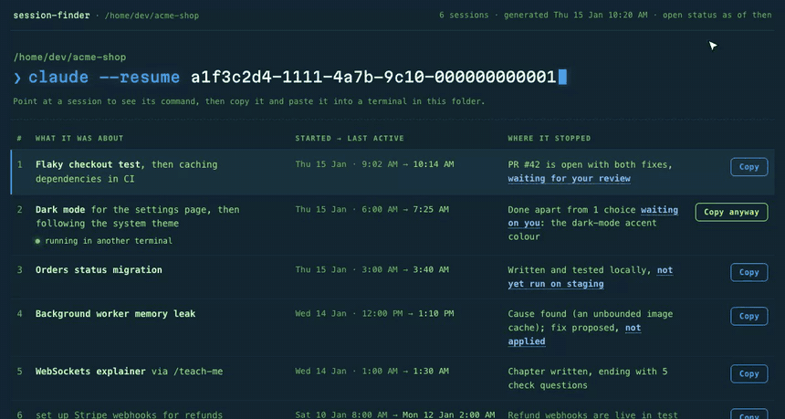
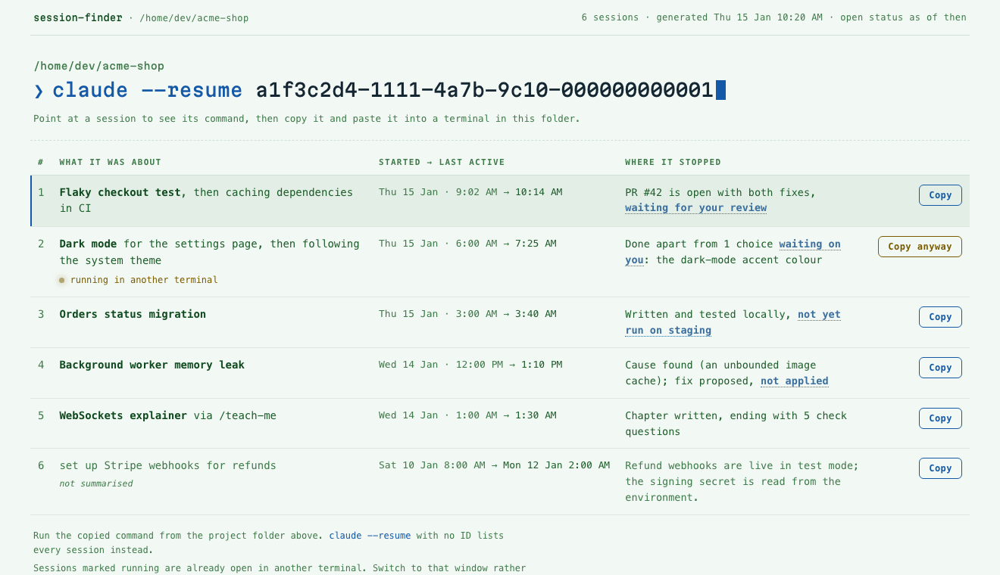
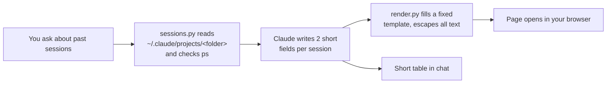

<h1 align="center">claude-skills</h1>

<p align="center">
  <b>Small Claude Code skills that do one job well.</b><br>
  <sub>Each one is tested, documented, and runs entirely on your machine.</sub>
</p>

<p align="center">
  
  
  <a href="https://github.com/santanusetu/claude-skills/actions/workflows/test.yml"></a>
  
</p>

---

## Skills

| Skill | What it does |
|---|---|
| **[session-finder](#session-finder)** | Find a past Claude Code session and get back into it, with 1-click resume |

## Install

```bash
claude plugin marketplace add santanusetu/claude-skills
claude plugin install session-finder@claude-skills --scope user
```

If you'd rather not use plugins, copy the folder in directly:

```bash
git clone https://github.com/santanusetu/claude-skills.git
cp -R claude-skills/skills/session-finder ~/.claude/skills/
```

---

# session-finder

```
/session-finder
what was I working on yesterday?
which session did the database migration? how do I get back into it?
show my last 6 sessions
```

`claude --resume` gives you a list of session titles. Once you have a few sessions going, that list stops helping. Titles are written in the first minute, sessions drift, and nothing tells you which one is **still open in another terminal**. Resume that one by accident and 2 processes write to the same session and overwrite each other's work.

`session-finder` reads the transcripts Claude Code already keeps and answers the question you actually have: *which session was that, where did I leave it, and is it safe to jump back in?*

### What you get

**A page in your browser** with your last 10 sessions: 1 click copies the exact command, and sessions still open elsewhere are flagged before you clash with them.

<p align="center">
  
</p>

**Dark mode:**

<p align="center">
  
</p>

**Light mode** (the page follows your system setting):

<p align="center">
  
</p>

### How it works



1. **A small Python script collects the facts.** For each session it gathers the first prompt, the last 3 prompts, the last reply, start and last-active times, and your `/rename` title if you set one. It skips subagent chatter, empty sessions and repeated prompts. `ps` shows which sessions are running right now.
2. **Claude writes the summaries.** It writes just 2 fields per session, *what it was about* and *where it stopped*, reading the recent prompts as well as the first, because sessions drift.
3. **A second script renders the page** from 1 fixed template. The layout stays the same every run, all text is escaped (so a pasted `<script>` is just text), and Claude never writes HTML.

**Details that matter:**
- **It excludes the session you're asking from**, using `CLAUDE_CODE_SESSION_ID`.
- **It works from a subfolder.** If Claude's shell has `cd`'d into `src/`, the script walks up to the folder the sessions belong to.
- **It orders by last message, not file time**, because Claude also writes to a transcript when a session closes.

### Privacy

- **Nothing leaves your machine.** The scripts read local files and run `ps`, with no network calls. The page loads nothing external: no CDN, no web fonts, no analytics.
- **The page holds summaries of your conversations**, so it lives under `~/.claude/`, not in your project, where it could be committed.
- **It's read-only.** It never edits, moves or deletes a transcript.
- **Transcripts can contain anything you pasted**, so the skill tells Claude to summarise rather than quote.

### Options

Ask in plain words ("last 6", "sessions for ~/api") and the skill passes these for you:

| Setting | Default | |
|---|---|---|
| `--count N` | 10 | sessions on the page (the first 4 go in the chat table) |
| `--project DIR` | current dir | another project's sessions |
| `--include-current` | off | include the session running the skill |
| `SESSION_FINDER_NO_OPEN=1` | unset | write the page but don't open a browser |
| `CLAUDE_CONFIG_DIR` | `~/.claude` | where Claude's transcripts, and this page, live |

### Requirements and limitations

- Python 3.8+ and Claude Code. No other dependencies.
- macOS and Linux. On Windows, open-session detection is unavailable.
- Summaries are based on the first and last few prompts of each session.
- Relies on Claude Code's transcript format, which is not a public API.

### Tests

```bash
python3 -m unittest discover -s tests/session-finder
```

24 tests run against fictional sessions, covering transcript parsing, open-session detection and the HTML page.

## Contributing

Contributions are welcome. See [CLAUDE.md](CLAUDE.md) for repository conventions, and start new skills from [`template/`](template).

## License

MIT © 2026 Santanu Chakraborty. See [LICENSE](LICENSE).
