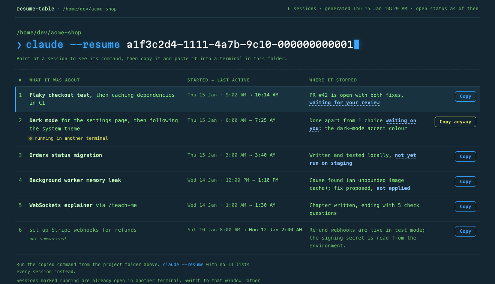
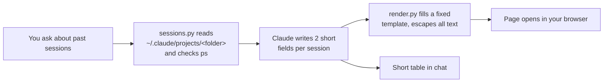

<h1 align="center">claude-skills</h1>

<p align="center">
  <b>Small Claude Code skills that do one job well.</b><br>
  <sub>Each one is tested, documented, and runs entirely on your machine.</sub>
</p>

<p align="center">
  
  
  <a href="https://github.com/santanusetu/claude-skills/actions/workflows/test.yml"></a>
  
</p>

---

## Skills

| Skill | What it does |
|---|---|
| **[resume-table](#resume-table)** | Find a past Claude Code session and get back into it, with 1-click resume |

## Install

```bash
claude plugin marketplace add santanusetu/claude-skills
claude plugin install resume-table@claude-skills --scope user
```

If you'd rather not use plugins, copy the folder in directly:

```bash
git clone https://github.com/santanusetu/claude-skills.git
cp -R claude-skills/skills/resume-table ~/.claude/skills/
```

---

# resume-table

```
/resume-table
what was I working on yesterday?
which session did the database migration? how do I get back into it?
show my last 6 sessions
```

`claude --resume` gives you a list of session titles. Once you have a few sessions going, that list stops helping. Titles are written in the first minute, sessions drift, and nothing tells you which one is **still open in another terminal**. Resume that one by accident and 2 processes write to the same session and overwrite each other's work.

`resume-table` reads the transcripts Claude Code already keeps and answers the question you actually have: *which session was that, where did I leave it, and is it safe to jump back in?*

### What you get

**A page in your browser** with your last 10 sessions: 1 click copies the exact command, and sessions still open elsewhere are flagged before you clash with them.

<p align="center">
  
</p>

<details>
<summary>Light mode (it follows your system setting)</summary>


</details>

- **Point at a row** and the prompt at the top types out its command. **Copy** puts exactly that on your clipboard.
- **A session running in another terminal** gets a pulsing yellow marker and a **Copy anyway** button, plus a reminder to switch windows instead.
- **1 self-contained file** at `~/.claude/resume-table/sessions.html`. It downloads nothing, uses an embedded font, and is overwritten on each run.
- **The colours are [Cobalt Neon](https://github.com/mbadolato/iTerm2-Color-Schemes)**, from iTerm2-Color-Schemes, with a light version of the same palette.

**And a short table in chat**, for when you just need the answer:

> Your last 4 sessions in `/home/dev/acme-shop`, newest first. All from Thu 15 Jan; this session is left out.

| # | What it was about | Started | Last active | Where it stopped | Resume with |
|---|---|---|---|---|---|
| 1 | **Flaky checkout test**, then caching dependencies in CI | 9:02 AM | 10:14 AM | PR #42 is open with both fixes, **waiting for your review** | `claude --resume a1f3c2d4-1111-4a7b-9c10-000000000001` |
| 2 | **Dark mode** for the settings page, then following the system theme | 6:00 AM | 7:25 AM | Done apart from 1 choice **waiting on you**: the accent colour. ⚠️ **Open now** | `claude --resume b2e4d3c5-2222-4b8c-8d21-000000000002` |
| 3 | **Orders status migration** | 3:00 AM | 3:40 AM | Written and tested locally, **not yet run on staging** | `claude --resume c3d5e4f6-3333-4c9d-9e32-000000000003` |
| 4 | **Background worker memory leak** | Wed 12:00 PM | Wed 1:10 PM | Cause found (an unbounded image cache); fix proposed, **not applied** | `claude --resume d4c6f5a7-4444-4dae-8f43-000000000004` |

*(All examples are fictional, taken from the [test fixtures](tests/resume-table/build_fixtures.py). Rebuild the screenshots with `python3 tests/resume-table/build_example.py`.)*

### How it works



1. **A small Python script collects the facts.** For each session it gathers the first prompt, the last 3 prompts, the last reply, start and last-active times, and your `/rename` title if you set one. It skips subagent chatter, empty sessions and repeated prompts. `ps` shows which sessions are running right now.
2. **Claude writes the summaries.** It writes just 2 fields per session, *what it was about* and *where it stopped*, reading the recent prompts as well as the first, because sessions drift.
3. **A second script renders the page** from 1 fixed template. The layout stays the same every run, all text is escaped (so a pasted `<script>` is just text), and Claude never writes HTML.

**Details that matter:**
- **It excludes the session you're asking from**, using `CLAUDE_CODE_SESSION_ID`.
- **It works from a subfolder.** If Claude's shell has `cd`'d into `src/`, the script walks up to the folder the sessions belong to.
- **It orders by last message, not file time**, because Claude also writes to a transcript when a session closes.

### Privacy

- **Nothing leaves your machine.** The scripts read local files and run `ps`, with no network calls. The page loads nothing external: no CDN, no web fonts, no analytics.
- **The page holds summaries of your conversations**, so it lives under `~/.claude/`, not in your project, where it could be committed.
- **It's read-only.** It never edits, moves or deletes a transcript.
- **Transcripts can contain anything you pasted**, so the skill tells Claude to summarise rather than quote.

### Options

Ask in plain words ("last 6", "sessions for ~/api") and the skill passes these for you:

| Setting | Default | |
|---|---|---|
| `--count N` | 10 | sessions on the page (the first 4 go in the chat table) |
| `--project DIR` | current dir | another project's sessions |
| `--include-current` | off | include the session running the skill |
| `RESUME_TABLE_NO_OPEN=1` | unset | write the page but don't open a browser |
| `CLAUDE_CONFIG_DIR` | `~/.claude` | where Claude's transcripts, and this page, live |

### Requirements and limits

- **Python 3.8+ and Claude Code.** No dependencies.
- **macOS and Linux get full support.** On Windows everything works except open-session detection, which needs `ps`.
- **Summaries come from the first and last few prompts**, so a long session's middle chapters can be under-described. Ask Claude to look closer at a specific row if needed.
- **A plain `claude` process has no session ID on its command line**, so it's reported as unidentified rather than matched to a row.
- **This relies on Claude Code's transcript format**, which isn't a public API. If an update changes it, the tests will catch it.

### Tests

```bash
python3 -m unittest discover -s tests/resume-table
```

There are 24 tests against 7 [fictional sessions](tests/resume-table/build_fixtures.py). They cover ordering, count, excluding the current session, empty sessions, subfolders, custom titles, subagent messages, malformed lines, open-session detection, and for the page: escaping, the running-session warning, no external requests, theme handling and the empty state. You can also try the skill itself on the fixtures, without any real sessions: see [`tests/resume-table`](tests/resume-table).

## Contributing

Ideas and fixes are welcome. [`CLAUDE.md`](CLAUDE.md) has the layout, the privacy rule and the checklist for adding a skill, and [`template`](template) is a starting point.

## License

MIT
